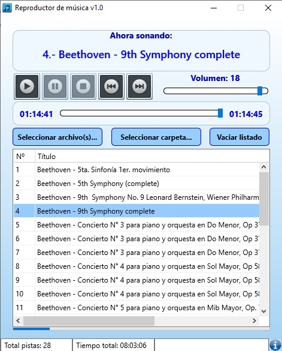
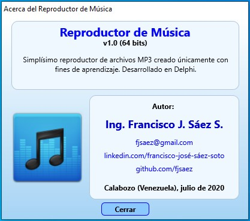

# Reproductor de Música

---

## Descripción

Simplísimo reproductor de archivos MP3. Puede cargar uno o más archivos en un listado. Está en capacidad de ejecutar, pausar, detener, adelantar y retroceder una pista. En resumen, tiene las funcionalidades mínimas de cualquier reproductor de audio, sin más.

## Notas

* Compilado para 32 y 64 bits.
* No se usó ningún skin, aunque se modificó el aspecto de algunos componentes.
* **Aún en fase de desarrollo**, pero ya es totalmente funcional.
* Es desarrollado únicamente con intenciones de aprendizaje.

---

## Lenguaje/framework/base de datos

* Lenguaje: Delphi 10.2 Tokyo, empleando sólo componentes nativos. 
* Framework: Firemonkey. 
* Base de datos: SQLite v3.

---

## Instalación

No requiere de instalación y es totalmente portable. La aplicación consta de dos archivos: **ReproMusica.exe** (el ejecutable) y **ReproMusica.db** (la base de datos donde guarda el listado y configuración). Ambos deberán estar almacenados en la misma carpeta, pues de lo contrario el ejecutable se detendrá si no consigue la BD.

---

## Autor

Ing. Francisco José Sáez Soto.

e-mail: **fjsaez@gmail.com**

LinkedIn: **linkedin.com/francisco-josé-sáez-soto**

GitHub: **github.com/fjsaez**

---

Calabozo (Venezuela), julio de 2020.

---

## Link de descarga de ejecutables

Vienen dos archivos en un comprimido (ReproMusica_XX.rar): ReproMusica.exe y ReproMusica.db

32 bits: https://mega.nz/file/bsUGkKQa#Snlb7AS5jilqaB2dnJ_CkLhI9WGk_UmAz9wMSigdmHU

64 bits: https://mega.nz/file/OxFmVYwY#HKJ2UQtcx_Z34F3WEn5gkwNUNlHrx9452WjlbkPc4eQ

## Imágenes de la aplicación

### Icono

### Pantalla principal

### Acerca...

